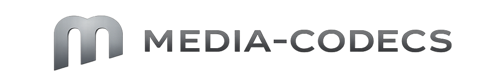

<div align="center">



**Codec framework for the [Kryx](https://kryx.dev) multimedia ecosystem**

Pluggable encoders & decoders · Built-in PCM · Built on `@brashkie/media-core`

[](https://github.com/Brashkie/media-codecs/actions)
[](https://npmjs.com/package/@brashkie/media-codecs)
[](LICENSE)
[](https://nodejs.org)

**English** · [Español](README.es.md) · [Architecture](docs/ARCHITECTURE.md) · [Roadmap](docs/ROADMAP.md) · [Changelog](CHANGELOG.md)

</div>

---

## What is this?

`@brashkie/media-codecs` is the **codec layer** of [Kryx](https://kryx.dev). It provides:

- A pluggable **registry** for runtime codec lookup
- Async `Decoder` / `Encoder` classes with a uniform API
- Built-in **PCM** codecs (s16le, s32le, f32le, f64le)
- Foundation for the upcoming Opus, AAC, H264, AV1 implementations

It does **not** include heavyweight codecs yet — those land in v0.2+ as separate codec modules backed by Zig. The PCM codecs are the reference implementation of the codec protocol.

```bash
npm install @brashkie/media-codecs
```

```ts
import { createDecoder, createEncoder, registry } from '@brashkie/media-codecs'

// Inspect what's available
console.log(registry().names())
// → ['pcm_f32le', 'pcm_f64le', 'pcm_s16le', 'pcm_s32le']

// PCM round-trip
const enc = createEncoder('pcm_s16le', { channels: 2, sampleRate: 48_000 })
const dec = createDecoder('pcm_s16le', { channels: 2, sampleRate: 48_000 })

const pkt = await enc.encode({
  payload: Buffer.alloc(8),
  pts: 0, dts: 0, isKeyframe: true, duration: 0,
})

const frame = await dec.decode(pkt.payload, pkt.pts)
console.log(frame.pts, frame.duration) // → 0, 2
```

---

## Why?

| | |
|---|---|
| 🔌 **Pluggable** | New codecs register at startup — public API never changes |
| ⚡ **Async-first** | All decode/encode calls return Promises — backpressure-friendly |
| 🎯 **Zero-cost for PCM** | Validates + tags metadata, no actual copy |
| 🧩 **Built on media-core** | Reuses `MediaError`, same ecosystem |
| 🔒 **Type-safe** | TypeScript 6.0 strict + auto-generated `.d.ts` |
| 📦 **Dual-package** | ESM + CJS, with proper exports map |
| 🌐 **Cross-platform** | Windows, macOS, Linux on x64 and arm64 |

---

## Core concepts

### Registry

```ts
import { registry, CodecKind } from '@brashkie/media-codecs'

const reg = registry()

reg.names()              // string[] — all registered codec names
reg.has('pcm_s16le')     // boolean
reg.find('pcm_s16le')    // CodecDescriptor | null
reg.list('audio')        // CodecDescriptor[] filtered by kind
```

### Decoder

```ts
import { createDecoder } from '@brashkie/media-codecs'

const dec = createDecoder('pcm_s16le', {
  sampleRate: 48_000,
  channels: 2,
})

const frame = await dec.decode(encodedBytes, /* pts */ 90_000)
console.log(frame.pts, frame.duration, frame.isKeyframe)

const trailing = await dec.flush()  // drain at EOS
await dec.reset()                    // after a seek
```

### Encoder

```ts
import { createEncoder } from '@brashkie/media-codecs'

const enc = createEncoder('pcm_f32le', {
  sampleRate: 48_000,
  channels: 2,
})

const packet = await enc.encode({
  payload: rawSamples,
  pts: 0, dts: 0, isKeyframe: true, duration: 0,
})
```

### Error handling

```ts
import { CodecError } from '@brashkie/media-codecs'
import { MediaError } from '@brashkie/media-core'

try {
  await dec.decode(badBytes)
} catch (err) {
  if (err instanceof CodecError) {
    console.log(err.codecKind) // "invalid_data", "not_found", ...
  }
  if (MediaError.is(err)) {
    console.log(err.kind)      // shared with the rest of Kryx
  }
}
```

---

## Built-in codecs (v0.1)

| Name | Long name | Kind | Encode | Decode |
|------|-----------|------|--------|--------|
| `pcm_s16le` | PCM signed 16-bit little-endian | audio | ✅ | ✅ |
| `pcm_s32le` | PCM signed 32-bit little-endian | audio | ✅ | ✅ |
| `pcm_f32le` | PCM 32-bit float little-endian   | audio | ✅ | ✅ |
| `pcm_f64le` | PCM 64-bit float little-endian   | audio | ✅ | ✅ |

All are lossless, stateless (except for the PTS counter), and validated against frame alignment.

---

## Roadmap

See [docs/ROADMAP.md](docs/ROADMAP.md). Next up:

- **v0.2** — Opus (first Zig-backed codec)
- **v0.3** — AAC + FLAC
- **v0.4** — H264 decoder
- **v0.5** — Hardware acceleration
- **v0.6** — AV1 + VP9
- **v1.0** — Stable API

---

## Development

```bash
git clone https://github.com/Brashkie/media-codecs.git
cd media-codecs
npm install
npm run build:debug
npm test
```

See [CONTRIBUTING.md](CONTRIBUTING.md) for the full workflow.

---

## License

[Apache-2.0](LICENSE) © 2026 [Brashkie](https://github.com/Brashkie)

---

<div align="center">

Made with 🦀 + ⚡ for the modern multimedia web.

[Website](https://kryx.dev) · [Issues](https://github.com/Brashkie/media-codecs/issues)

</div>
